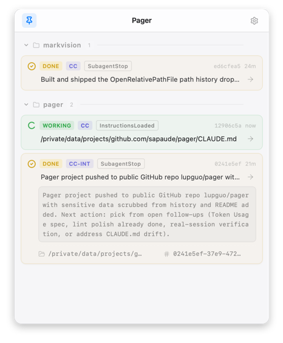
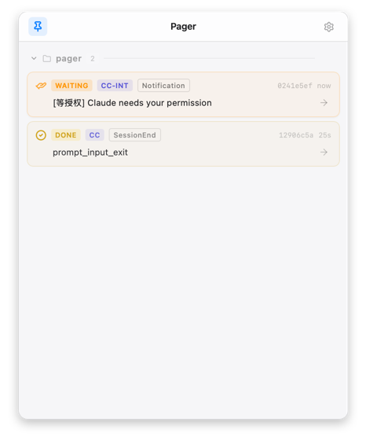

# VibeCoding Pager

> macOS MenuBar app for **AI coding agent status awareness**. Claude Code / CodeBuddy hooks push events → VibeCoding Pager shows notifications + a session list → click to jump back to the right terminal tab.

[](https://go.dev/)
[](https://wails.io/)
[](https://www.apple.com/macos/)

---

## 中文简介

当你同时跑多个 AI coding agent（Claude Code / Claude Code Internal / CodeBuddy）时，常见痛点是：

- 切走干别的事，agent 已经停下来等你回答，但你不知道
- 一堆 terminal tab，分不清哪个 session 在等输入、哪个在跑、哪个出错了
- 想批准/拒绝某次工具调用，得手动找回那个 tab

**Pager** 就是这个场景的"寻呼机"（项目名 `vibecoding-pager`）：常驻 MenuBar，通过 Claude Code 的 hook 机制接收事件，弹原生通知 + 维护会话列表，点击跳回对应 terminal tab。Hook 是 fire-and-forget —— **不阻塞 agent**，不影响你的工作流。

---

## Features

<table>
<tr>
<td width="50%"></td>
<td width="50%"></td>
</tr>
<tr>
<td align="center"><sub>Session list with 4-state status pills</sub></td>
<td align="center"><sub><code>[等输入]</code> typed notification + waiting state</sub></td>
</tr>
</table>

- **MenuBar tray** — always-on session pulse with 4-state colored icons (working / waiting / done / error)
- **Native macOS notifications** — `[等授权] / [等输入]` typed labels distinguish permission vs input prompts
- **Session list** — click any session to jump to its iTerm2 / Terminal.app tab
- **SQLite-persisted history** — replays sessions on app startup; soft-delete via Dismiss
- **Multi-agent ready** — Claude Code, Claude Code Internal, CodeBuddy share the same bridge protocol
- **Global hotkey** — toggle window from anywhere (configurable)
- **i18n** — zh-CN and en-US

## Data Flow

```
CC / CodeBuddy hook (stdin JSON)
        │
        ▼
  pager-bridge                 (CLI binary, must exit 0 silently)
        │
        ▼  HTTP POST :7421
   VibeCoding Pager.app
   ├── Registry              (in-memory state machine)
   ├── SQLite EventStore     (~/Library/Application Support/VibeCoding Pager/pager.db)
   ├── macOS Notification    (osascript)
   └── React UI              (Wails v3 + zustand)
```

See [`ARCHITECTURE.md`](./ARCHITECTURE.md) for the full four-layer (`domain` / `adapter` / `infra` / `wails`) directory convention and dependency rules.

## Tech Stack

| Layer       | Choice                                                        |
|-------------|---------------------------------------------------------------|
| Backend     | Go 1.25 · `log/slog` · `jmoiron/sqlx` (SQLite) · `tidwall/gjson` |
| Framework   | [Wails v3 alpha.96](https://wails.io/) (Go ↔ React bridge)    |
| Frontend    | React 18 · TypeScript 5 · Tailwind 3 · zustand · i18next      |
| OS APIs     | `osascript` (notifications + terminal jump) · `golang.design/x/hotkey` |
| Build       | Vite 6 · `make`                                               |

## Quickstart

### Prerequisites

- macOS (Apple Silicon or Intel)
- Go ≥ 1.25
- Node ≥ 20
- Wails CLI v3:
  ```bash
  go install github.com/wailsapp/wails/v3/cmd/wails3@latest
  ```

### Build & Run

```bash
git clone git@github.com:lupguo/vibecoding-pager.git
cd vibecoding-pager
make frontend-deps          # one-time: npm install
make dev                    # hot-reload dev mode (Wails + Vite)
```

For a production `.app` bundle:

```bash
make build                  # outputs bin/VibeCoding Pager.app
open "bin/VibeCoding Pager.app"
```

### Install Hooks

After VibeCoding Pager is running, register the bridge with all supported agents in one shot:

```bash
make install-bridge   # builds pager-bridge + pager-installhooks, then writes
                      #   ~/.claude/settings.local.json           (Claude Code)
                      #   ~/.claude-internal/settings.local.json  (Claude Code Internal)
                      #   ~/.codebuddy/settings.local.json        (CodeBuddy)
```

The Go-based installer is **append + idempotent**: re-running it never duplicates entries, replaces stale entries that point at the old `vibecoding-pager-cc-bridge` binary, and preserves any custom hook entries you've added by hand. Subsequent agent sessions stream events to VibeCoding Pager automatically.

> **After modifying any code under `internal/adapter/bridge/`, `cmd/pager-bridge/`, or `cmd/pager-installhooks/`**, re-run `make install-bridge` to rebuild and reinstall. `make dev` / `make run` / `make build` already do this for you.

## Configuration

VibeCoding Pager runtime data (settings + SQLite) lives under one base directory:

| Mode        | Trigger                              | Path                                                |
|-------------|--------------------------------------|-----------------------------------------------------|
| Development | `make dev` / `make run`              | `<repo>/.config/pager/`                             |
| Production  | Double-click `VibeCoding Pager.app`  | `~/Library/Application Support/VibeCoding Pager/`   |
| Test / CI   | `PAGER_CONFIG_DIR=/tmp/x ./bin/vibecoding-pager` | `/tmp/x/`                               |

Resolution: `PAGER_CONFIG_DIR` env var → macOS-native default. The dev path keeps experiments isolated from your installed `VibeCoding Pager.app`.

## Make Targets

```text
make dev            Run in dev mode (Vite HMR + Wails hot-reload)
make build          Build production .app bundle
make run            Build Go binary + run (no Vite)
make stop           Free ports 9245 + 7421
make bridge         Build pager-bridge CLI (hook stdin → HTTP)
make installer      Build pager-installhooks (hook installer)
make install-bridge Build both binaries + install hooks for all agents
make bindings       Regenerate Wails Go ↔ TS bindings
make test           go test ./...
make lint           go vet + tsc --noEmit
make clean          Remove bin/ and frontend/dist
make help           List all targets
```

## Project Layout

```text
.
├── cmd/
│   ├── pager-bridge/        hook CLI binary; receives stdin, POSTs to :7421
│   ├── pager-installhooks/  Go installer that wires pager-bridge into agent hook configs
│   └── icongen/             dev-only icon generator
├── internal/
│   ├── domain/          entity/, session/ — business rules, zero framework deps
│   ├── adapter/         httpapi/, notify/, terminal/, bridge/ — IO boundaries
│   ├── infra/           log/, config/, store/ — cross-cutting tech
│   └── wails/           PagerApp + bindings (XxxBinding, XxxManager)
├── frontend/
│   ├── src/             React + TS + Tailwind + zustand
│   └── bindings/        auto-generated, gitignored
├── scripts/             install-launchd.sh
├── docs/                PRD, specs, plans
├── ARCHITECTURE.md      directory + dependency convention
└── CLAUDE.md            AI-collaboration cheatsheet
```

## Session State Machine

`Session.Status` is one of `working` / `waiting` / `done` / `error`. The mapping from `(EventType, ToolName, PermissionMode, hasPendingAskUser)` to status is centralized in `session.DeriveStatus` (`internal/domain/session/status.go`). Tracker, SQLite replay, notify predicate, and tray icon all delegate to that single function — see CLAUDE.md for the full table.

## Status

- ✅ **v1.0** — Claude Code hook flow, MenuBar UI, terminal jump, notifications
- ✅ **v1.5** — SQLite persistence with replay; CodeBuddy + Claude Code Internal support
- 🚧 **v1.x** — Token usage card (per-session model + remaining quota)
- ⛔ **out of scope** — Linux/Windows, multi-machine sync, in-app text replies to agent, hook return values that affect agent behavior

## v1.0 Non-Negotiables

These design choices are final:

1. Hook is fire-and-forget — no blocking, no return value, agent runs free
2. No approve / deny decisions inside Pager
3. Single-process Wails app (Daemon + UI fused)
4. `AgentEvent` is the only cross-layer data structure
5. Four-layer architecture: `domain ← adapter ← wails`, `infra` used by all

## Contributing

Pre-PR checklist:

```bash
make test          # all tests pass
make lint          # go vet + tsc --noEmit clean
make install-bridge   # if you touched cmd/bridge or internal/adapter/bridge
```

Conventions:

- Go: standard library preferred; bridge errors must be silent (`exit 0`)
- Logging: `log/slog` with `infra/log.Module("name")`
- Naming: `XxxBinding` for Wails, `XxxManager` for managers, `*_svc.go` for files
- Frontend: Tailwind utilities only; zustand for state; i18next for strings
- Bindings under `frontend/bindings/` are codegen — never hand-edit

## License

TBD.

---

Built with [Claude Code](https://claude.com/claude-code) using a brainstorm → spec → plan → subagent-driven-execute workflow. See `docs/superpowers/` for past cycles.
